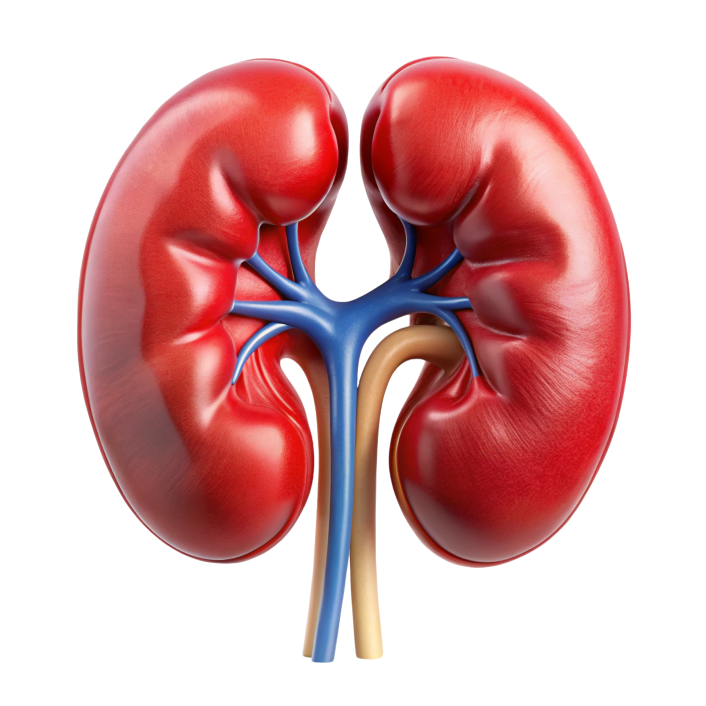
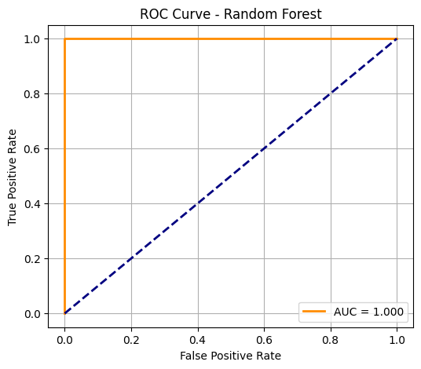
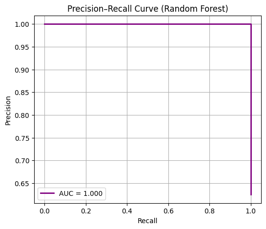
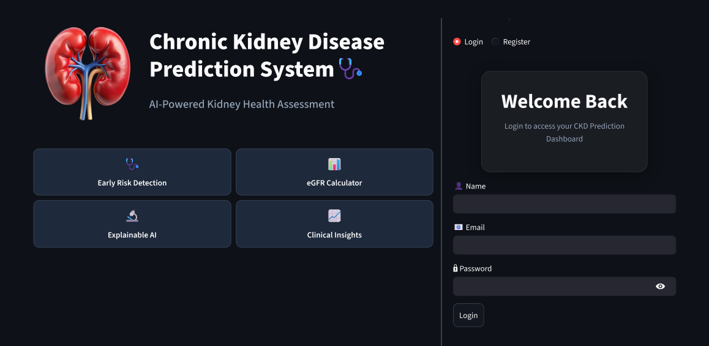
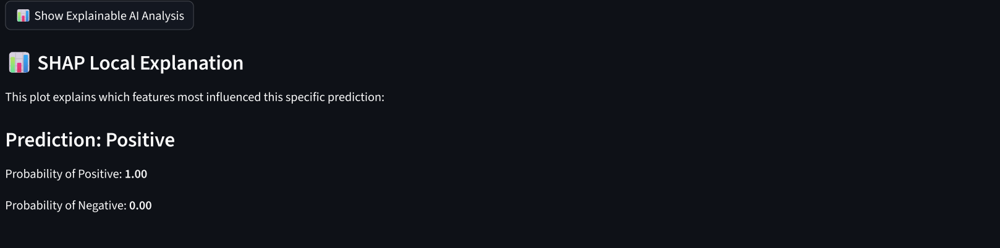

<p align="center">
  
</p>

<h1 align="center">
🩺 Chronic Kidney Disease Prediction System using Machine Learning
</h1>

<p align="center">
AI-Powered Kidney Health Assessment with Explainable AI, eGFR Analysis, User Authentication, and Prediction History Tracking
</p>

---

## 📌 About the Project

Chronic Kidney Disease (CKD) is a major non-communicable disease affecting 10–15% of the global population. Early detection is crucial to prevent severe complications such as hypertension, anemia, bone disorders, and kidney failure.

This project presents a complete Machine Learning-powered Clinical Decision Support System capable of:

- Predicting Chronic Kidney Disease (CKD)
- Calculating dynamic eGFR values using the CKD-EPI 2021 equation
- Determining CKD stage automatically
- Providing Clinical Interpretation based on patient parameters
- Explaining model decisions using SHAP Explainable AI
- Managing users through Login & Registration
- Storing prediction history using MySQL database
- Allowing users to review previous predictions

The application is built using Streamlit and provides an intuitive interface suitable for educational, research, and clinical decision-support purposes.
---

## 🎯 Objectives
```
✔ Early detection of CKD using Machine Learning
✔ Handle missing data, outliers, and class imbalance
✔ Compare 7 ML models and select the best one
✔ Use **Random Forest** as the final model
✔ Integrate **SHAP for interpretability**
✔ Deploy as a web app using **Streamlit**
✔ User Authentication using MySQL
✔ Prediction History Management
✔ Explainable AI using SHAP
✔ Real-time Clinical Interpretation
```
---

## 🧠 Machine Learning Models Used

We trained and compared the following models:

* Logistic Regression
* Decision Tree
* Random Forest ✅ *(Best Model)*
* SVM (RBF Kernel)
* Linear SVM
* K-Nearest Neighbors (KNN)
* Artificial Neural Network (ANN)

🏆 **Final Model Selected: Random Forest**

---

## 📊 Dataset

* **File used:** `Kidney_disease.csv`
* **Source:** UCI Machine Learning Repository
* **Records:** 400
* **Features:** 25
* **Classes:**

  * `ckd` → 250 samples
  * `notckd` → 150 samples

### Dataset Challenges & Solutions

| Issue            | Solution                          |
| ---------------- | --------------------------------- |
| Missing values   | Random sampling + Mode imputation |
| Class imbalance  | `class_weight='balanced'`         |
| Categorical data | Label Encoding                    |
| Mild outliers    | Detected but retained             |

---

## ⚙️ Methodology
<p align="center">
  
</p>


### Step 1 — Data Preprocessing

* Handling missing values
* Encoding categorical variables
* Checking class imbalance
* Outlier detection
* Feature importance analysis

### Step 2 — Model Training

* Train-test split: **80–20**
* 10-fold cross-validation
* Performance metrics: Accuracy, Precision, Recall, F1-score

### Step 3 — Best Model Selection

Random Forest achieved **perfect performance on the test set (80 samples).**

---

## ✅ FINAL MODEL PERFORMANCE (YOUR RESULTS)

### Confusion Matrix

<p align="center">
  
</p>
Interpretation:

* 30 patients correctly predicted as **NOT CKD (Class 0)**
* 50 patients correctly predicted as **CKD (Class 1)**
* **0 false positives and 0 false negatives**

### ROC Curve

<p align="center">
  
</p>

### Precision Recall Curve

<p align="center">
  
</p>

---

### Classification Report

| Class       | Precision | Recall   | F1-score | Support |
| ----------- | --------- | -------- | -------- | ------- |
| 0 (Not CKD) | **1.00**  | **1.00** | **1.00** | 30      |
| 1 (CKD)     | **1.00**  | **1.00** | **1.00** | 50      |

**Overall Accuracy: 1.00 (100%)**

* **Macro Avg:** 1.00
* **Weighted Avg:** 1.00

👉 This confirms that the model perfectly separated CKD and non-CKD cases on unseen test data.

---

## 🧮 Dynamic eGFR Calculation

The system calculates eGFR using the **CKD-EPI 2021 equation** and assigns CKD stage automatically:

| Stage    | eGFR Range |
| -------- | ---------- |
| Stage 1  | ≥ 90       |
| Stage 2  | 60–89      |
| Stage 3a | 45–59      |
| Stage 3b | 30–44      |
| Stage 4  | 15–29      |
| Stage 5  | < 15       |

This helps doctors understand **disease severity**, not just a binary prediction.

---

## 🧠 **Explainability using SHAP (Expanded Section)**

Machine learning models like Random Forest are powerful but act as “black boxes.” To make the system **clinically trustworthy**, we integrated **SHAP (SHapley Additive exPlanations)**.

### Why SHAP was used:

SHAP helps:

* Explain **why** the model made a prediction
* Identify **which features pushed the decision toward CKD or NOT CKD**
* Provide transparency for doctors and clinicians

### How SHAP was applied in this project:

We used:

1️⃣ **Global SHAP Explanation**

* Shows which features are most important across the entire dataset
* Helps understand key clinical drivers of CKD prediction
* Identifies critical biomarkers such as:

  * Serum creatinine
  * Blood urea
  * Hemoglobin
  * Blood pressure
  * Albumin

2️⃣ **Local SHAP Explanation (Individual Patient)**
For each patient prediction, SHAP explains:

* Which features increased CKD risk
* Which features reduced CKD risk
* By how much each feature contributed

3️⃣ **SHAP Waterfall Plot**

* Visual breakdown of one patient’s prediction
* Starts from base probability
* Shows step-by-step feature impact
* Very useful for medical interpretation

### Benefit of SHAP in Healthcare

SHAP makes the system:

* Transparent
* Clinically interpretable
* Trustworthy
* Suitable for decision support in hospitals

---

## 🌐 Web Application (Streamlit UI)

The system is deployed as a **multi-page Streamlit web app** with the following pages:

1. 🔐 Login System
2. 📝 User Registration
3. 📖 About the Project
4. 📋 User Instructions
5. 🏥 Medical Reference
6. 🧠 CKD Prediction Module
7. 🧪 eGFR Calculator
8. 🩺 Clinical Interpretation
9. 📊 SHAP Explainable AI
10. 📜 Prediction History
11. 🚪 Secure Logout

All user prediction records are stored in a MySQL database and can be viewed later through the Prediction History module.

# 📸 Application Screenshots
## 🔐 Login Page



## 📖 🧭 Navigation & About the Project Page


## 📋 User Instructions


## 🏥 Medical Reference


## 📝 Patient Input Parameters


## 🧠 CKD Prediction


## 🩺 Clinical Interpretation


## 📊 SHAP Explainability



## 🌊 SHAP Waterfall Plot


## 🔬 Feature Contribution Analysis


## ✔️ SHAP Additive Check


## 📜 Prediction History


The main entry point is:

```
app.py
```

---

## 🛠️ Tech Stack

| Component            | Tool                        |
| -------------------- | --------------------------- |
| Programming Language | Python                      |
| ML Library           | Scikit-learn                |
| Explainable AI       | SHAP                        |
| DataBase             | mySQL                       |
| Authentication       | bycrypt                     |
| Data Preprocessing   | Pandas,Numpy                |
| Visualization        | Matplotlib, Seaborn, Plotly |
| Web App              | Streamlit,HTML,CSS          |
| Development IDE      | PyCharm                     |
| Model Development    | Google Colab                |

---

## 🚀 How to Run the Project

### Step 1 — Clone the Repository

```bash
git clone https://github.com/your-username/ckd-prediction.git
cd ckd-prediction
```

### Step 2 — Install Dependencies

```bash
pip install -r requirements.txt
```

### Step 3 — Run Streamlit App

```bash
streamlit run app.py
```

---

## 📁 Repository Structure

```text
CKD-Prediction-System
│
├── app.py
├── model.py
├── database.py
├── db.py
├── login.py
├── register.py
├── history.py
├── about.py
├── medicalinfo.py
├── user_instructions.py
├── requirements.txt
├── README.md
│
├── screenshots/
│
├── Ckd_model.pkl
├── kidney_disease.csv
└── preprocessed_ckd.csv
```

---

## ✅ Strengths

```md
## ⭐ Key Features

- **100% test accuracy**
- Secure Login & Registration
- MySQL Database Integration
- Prediction History Tracking
- Explainable AI using SHAP
- Dynamic eGFR Calculation & staging
- Clinical Interpretation Engine
- Interactive Streamlit Interface
- User-Friendly Dashboard
---
```
## ⚠️ Limitations

* Dataset is relatively small (400 samples)
* Needs external validation on hospital data
* Random Forest is less interpretable than Logistic Regression

---

## 🔮 Future Work

* Train on real hospital dataset
* Add mobile app support
* Integrate live lab reports
* Add deep learning model
* Deploy on cloud (Streamlit Cloud / Heroku)

---

## 📚 References

1. UCI CKD Dataset
2. KDIGO Guidelines
3. SHAP: Lundberg & Lee (2017)
4. WHO CKD Reports

---

### ⭐ If you found this project useful, please give it a star on GitHub!
